<div align="center">


# DataPilot AI

### Navigate Your Data Career — With AI

**An AI-powered career intelligence platform for Data Analysts, Data Scientists, Data Engineers, and ML professionals.**

[](https://www.python.org/)
[](https://streamlit.io/)
[](https://www.postgresql.org/)
[](https://www.sqlalchemy.org/)
[](https://ai.google.dev/)
[](#license)
[]()

[Overview](#project-overview) • [Features](#key-features) • [Architecture](#architecture) • [Installation](#installation-guide) • [Roadmap](#roadmap) • [Contributing](#contributing)

</div>

---

## Project Overview

**DataPilot AI** is a career-intelligence platform built specifically for the data ecosystem — Data Analysts, Data Scientists, Data Engineers, ML Engineers, BI Analysts, Analytics Engineers, and Business Analysts.

**The problem it solves:** entry-level and early-career data professionals — especially freshers — often get filtered out before a human ever sees their resume, because their resumes aren't aligned with what applicant tracking systems and hiring pipelines actually look for. Generic resume tools give generic advice. They don't understand what a hiring pipeline for a *Data Analyst* role expects versus an *ML Engineer* role.

DataPilot AI closes that gap by combining **resume intelligence, skill benchmarking, salary modeling, and AI-driven mentorship** into a single guided workflow — so a user goes from "here's my resume" to "here's exactly what to fix, what to learn, and what I'm worth" in minutes.

**Who it's for:**
- Data professionals actively job-hunting who want an honest, data-backed read on their resume and market position
- Students and freshers trying to break into data/ML roles
- Anyone who wants a private, always-available AI career coach instead of guesswork

---

## Key Features

DataPilot AI ships six AI-powered modules, each implemented and wired into the live application:

<table>
<tr>
<td width="50%" valign="top">

### 📄 Resume Analyzer
Parses uploaded resumes (PDF, via `pdfplumber` / `pypdfium2` / OCR fallback with `pytesseract`) and evaluates them against ATS and recruiter expectations for data roles.
- ATS compatibility scoring
- Keyword and formatting feedback
- Recruiter-readiness assessment

**Why it matters:** most rejections happen before a human reads the resume. Fixing ATS issues directly improves shortlist odds.

</td>
<td width="50%" valign="top">

### 🎯 Skill Gap Analysis
Compares a user's extracted skill profile against real job-market requirements for their target role.
- Detects missing / weak skills
- Benchmarks against target roles
- Produces a priority-ranked learning path

**Why it matters:** tells you *what* to learn next instead of leaving you to guess.

</td>
</tr>
<tr>
<td width="50%" valign="top">

### 💰 Salary Predictor
Uses trained ML models (`scikit-learn`, `XGBoost`, `CatBoost`) to estimate market compensation.
- Experience and location-adjusted estimates
- Role and skill-based multipliers

**Why it matters:** walk into a negotiation with data instead of a guess.

</td>
<td width="50%" valign="top">

### 🧭 Job Role Fit Predictor
Uses trained ML models (`scikit-learn`) to Score how well a resume matches a target job description with an explainable confidence score.
- Resume-to-role matching
- Strength / weakness breakdown
- Alternative role suggestions

**Why it matters:** helps professionals discover adjacent roles they're already qualified for.

</td>
</tr>
<tr>
<td width="50%" valign="top">

### 🤖 AI Career Mentor
A conversational coaching layer powered by **Google Gemini** (`google-genai`).
- Personalized career guidance
- Interview preparation support
- Actionable, goal-oriented advice

**Why it matters:** gives users a 24/7 sounding board instead of a one-time report.

</td>
<td width="50%" valign="top">

### 📊 Market Intelligence
Aggregates and visualizes hiring trends using `pandas`, `plotly`, `matplotlib`, and `wordcloud`.
- Trending in-demand skills
- Salary trend visualizations
- Industry demand analytics

**Why it matters:** keeps advice grounded in what the market is *actually* hiring for right now, not outdated assumptions.

</td>
</tr>
</table>

> Authentication (Login / Signup) is implemented as part of the core application flow, gating access to the modules above.

---

## Screenshots

> Screenshots live in `reports/dashboard_images/`. Replace the placeholders below as the UI evolves.

| Landing Page | Login | Signup |
|:---:|:---:|:---:|
| 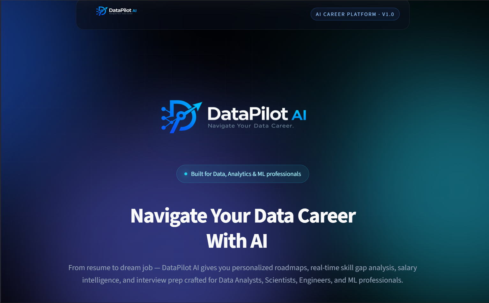 | 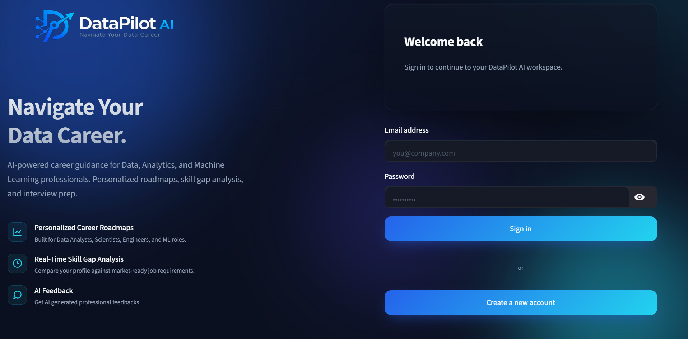 | 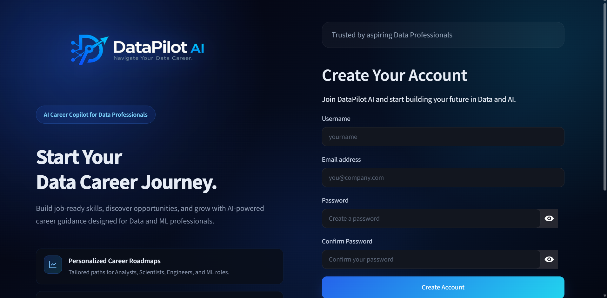 |

| Dashboard | Resume Analyzer | Skill Gap Analysis |
|:---:|:---:|:---:|
| 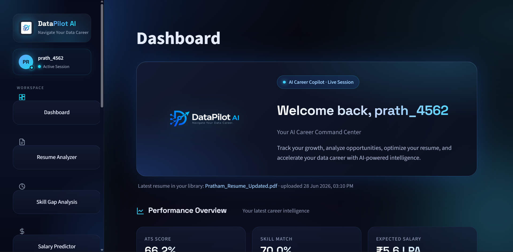 | 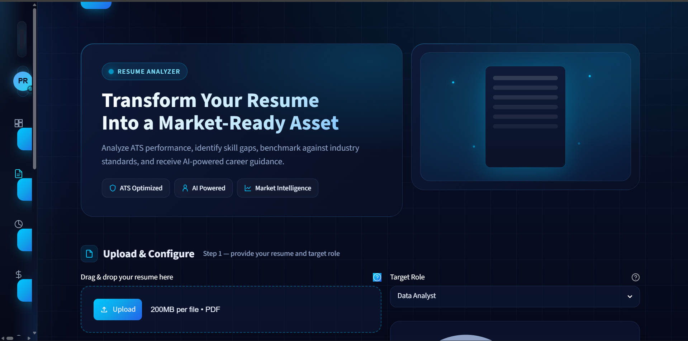 | 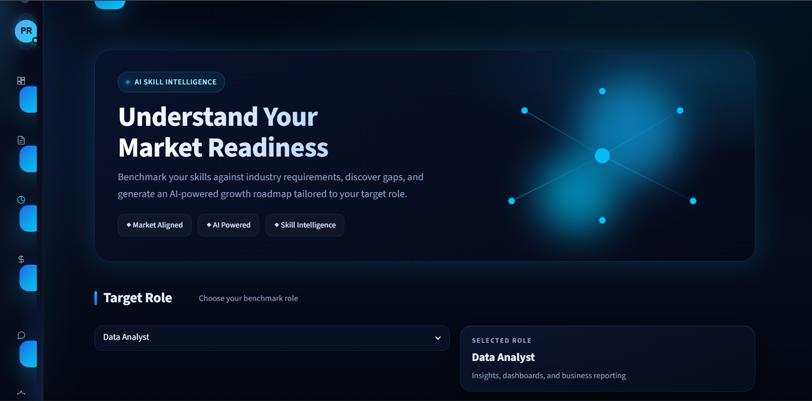 |

| Salary Predictor | AI Career Mentor | Job Fit Predictor |
|:---:|:---:|:---:|
| 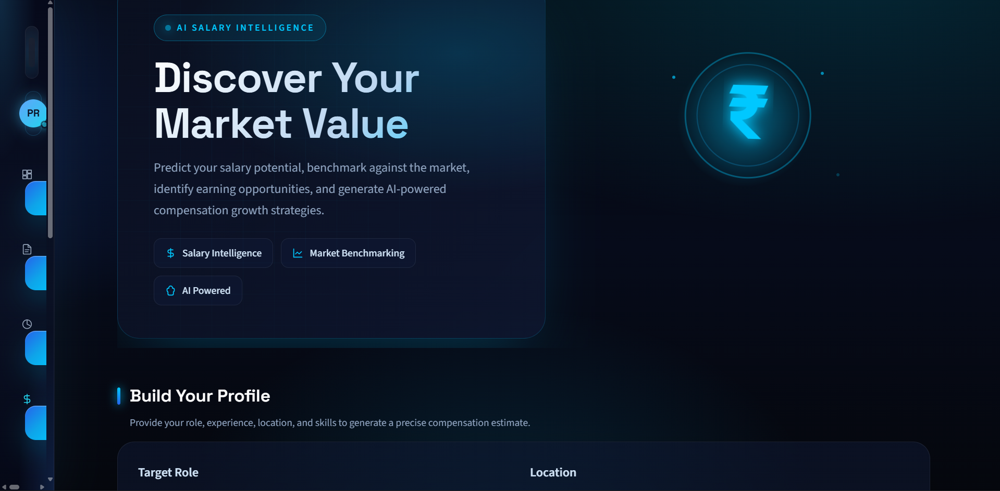 | 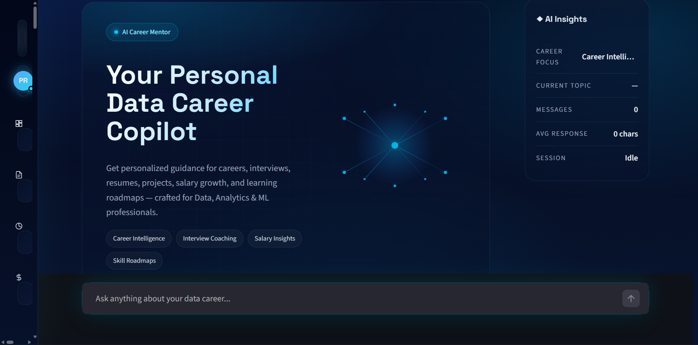 | 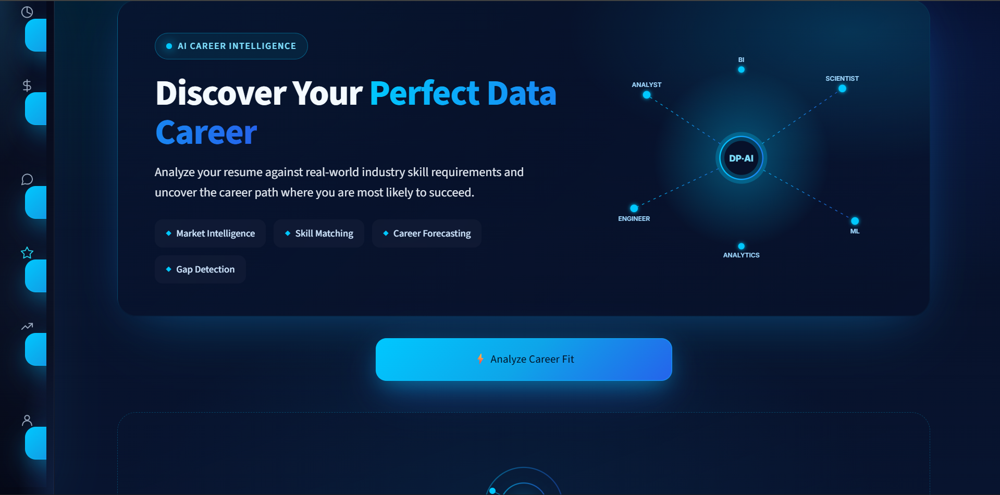 |

| Market Intelligence | Profile |
|:---:|:---:|
| 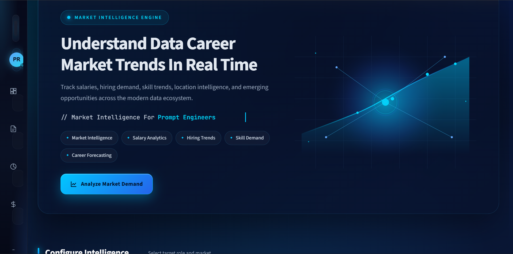 | 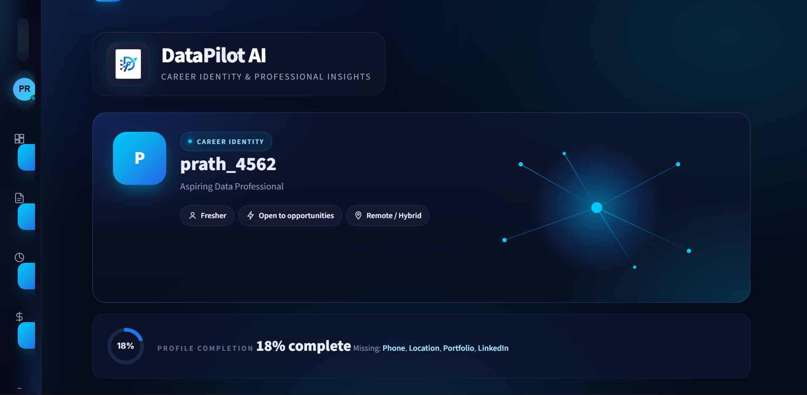 |
---

## Architecture

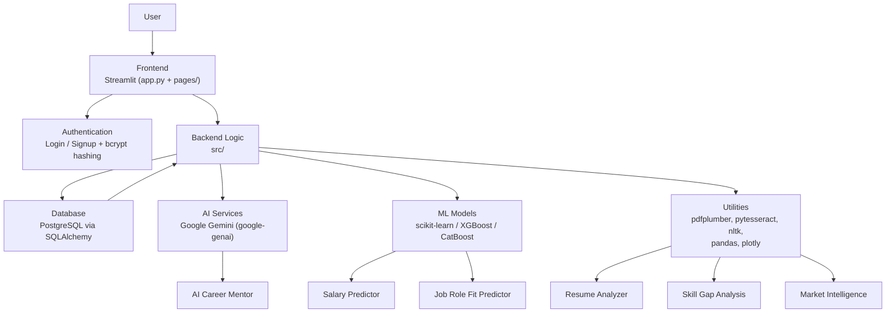

---

## Folder Structure

```
datapilot-ai/
├── app.py                      # Streamlit entry point — landing page, routing, global styling
├── requirements.txt            # Python dependencies
├── assets/                     # Logos, icons, and static styling assets
├── components/                 # Reusable UI building blocks for the Streamlit app
├── pages/                      # Streamlit multi-page app views
│   ├── 1_Login.py              # User authentication (sign in)
│   ├── 2_Signup.py             # User registration
│   └── ...                     # Additional feature pages (dashboard, analyzers, mentor)
├── src/                        # Core application logic (auth, DB models, ML inference, AI integration)
├── data/                       # Datasets used for model training / reference data
├── notebooks_testing/          # Jupyter notebooks for EDA, model training, and experimentation
├── reports/
│   └── dashboard_images/       # Screenshots and generated visual reports
└── .gitignore
```

> Note: `src/`, `components/`, and `data/` contain multiple internal modules whose exact contents evolve frequently — see the repository directly for the latest file-level breakdown.

---

## Tech Stack

| Layer | Technology |
|---|---|
| **Language** | Python |
| **Frontend Framework** | Streamlit (`streamlit`, `streamlit-autorefresh`, `streamlit-tags`) |
| **Database** | PostgreSQL |
| **ORM** | SQLAlchemy 2.0 (`psycopg2-binary` driver) |
| **Machine Learning** | scikit-learn, XGBoost, CatBoost, joblib |
| **NLP** | NLTK, WordCloud |
| **AI / LLM** | Google Gemini (`google-genai`, `google-ai-generativelanguage`) |
| **Document Processing** | pdfplumber, pdf2image, pypdfium2, pytesseract (OCR), fpdf2, reportlab |
| **Data Handling** | pandas, NumPy, PyArrow |
| **Visualization** | Plotly, Matplotlib, Seaborn, Altair, PyDeck |
| **Web / Scraping Utilities** | BeautifulSoup4, lxml, requests |
| **Authentication & Security** | bcrypt, cryptography |
| **Configuration** | python-dotenv |
| **Styling** | Custom CSS (dark "aurora" theme embedded in `app.py`) |

---

## Installation Guide

**Prerequisites:** Python 3.10+, PostgreSQL running locally or remotely, a Google Gemini API key.

```bash
# 1. Clone the repository
git clone https://github.com/Prathamesh-14-a/datapilot-ai.git
cd datapilot-ai

# 2. Create and activate a virtual environment
python -m venv venv
source venv/bin/activate      # On Windows: venv\Scripts\activate

# 3. Install dependencies
pip install -r requirements.txt

# 4. Configure environment variables
cp .env.example .env          # create this file if it doesn't exist yet
# then edit .env with your own values (see table below)

# 5. Launch the application
streamlit run app.py
```

The app will be available at `http://localhost:8501`.

---

## Environment Variables

The dependencies used (`google-genai` for AI and `SQLAlchemy` + `psycopg2` for PostgreSQL) require credentials to be supplied via environment variables. At minimum, configure:

| Variable | Purpose |
|---|---|
| `GEMINI_API_KEY` | Authenticates requests to the Google Gemini API powering the AI Career Mentor |
| `DATABASE_URL` | PostgreSQL connection string used by SQLAlchemy |

> Confirm the exact variable names against your local `.env` / config module in `src/`, since naming conventions may differ slightly from the above.

---

## How It Works

1. **Sign up / Log in** — Create an account or authenticate securely (passwords hashed with `bcrypt`).
2. **Upload Resume** — DataPilot AI parses the resume (including OCR fallback for scanned PDFs) and extracts skills, experience, and structure.
3. **Analyze** — The platform runs ATS scoring, skill-gap analysis, salary prediction, and job-fit scoring in parallel.
4. **Get Guidance** — The AI Career Mentor (Gemini-powered) turns the analysis into a personalized, conversational action plan.
5. **Track Market Fit** — Market Intelligence visualizations show how the user's profile compares to current hiring trends.

---

## Current Features

- [x] Streamlit landing page with feature overview
- [x] User authentication (Login / Signup)
- [x] Resume Analyzer (ATS scoring)
- [x] Skill Gap Analysis
- [x] Salary Predictor (ML-based)
- [x] Job Role Fit Predictor
- [x] AI Career Mentor (Gemini-powered)
- [x] Market Intelligence dashboards
- [ ] Public deployment / hosted demo
- [ ] Automated CI/CD pipeline

---

## Roadmap

- [ ] Resume versioning and history tracking
- [ ] Personalized job recommendations feed
- [ ] AI-driven interview simulator
- [ ] Structured learning roadmaps tied to skill gaps
- [ ] Deeper analytics dashboard for long-term progress tracking
- [ ] Cloud deployment (Docker + managed PostgreSQL)

---

## Security

- **Password hashing** via `bcrypt`
- **Encryption utilities** via the `cryptography` package
- **Environment-based secrets management** via `python-dotenv` (API keys and DB credentials kept out of source control)
- **Relational data integrity** enforced through SQLAlchemy models against PostgreSQL

---

## Contributing

Contributions are welcome.

1. Fork the repository
2. Create a feature branch: `git checkout -b feature/your-feature-name`
3. Commit your changes: `git commit -m "Add: your feature"`
4. Push to your branch: `git push origin feature/your-feature-name`
5. Open a Pull Request describing the change and its motivation

Please keep PRs focused and include context on *why* a change is needed, not just *what* changed.

---

## License

This project is licensed under the **MIT License**. See the [LICENSE](LICENSE) file for details.

---

## Author

**Prathamesh Ambul**

[](https://github.com/Prathamesh-14-a)
[](https://www.linkedin.com/in/pratham-data-analyst/)
[](#)
[](prathmeshambulge56@gmail.com)

---

## Support

If DataPilot AI is useful to you:

- ⭐ **Star this repository** — it helps others discover the project
- 🐛 [Open an issue](https://github.com/Prathamesh-14-a/datapilot-ai/issues) for bugs
- 💡 [Request a feature](https://github.com/Prathamesh-14-a/datapilot-ai/issues) if something's missing
- 💬 Start a discussion to share how you're using DataPilot AI

<div align="center">

**Built for the people navigating their next move in data.**

</div>
